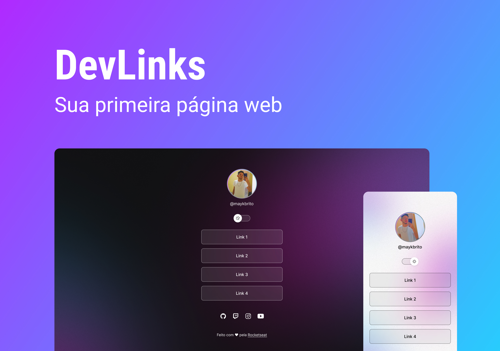

<h1 align="center"> DevLinks</h1>

 Evento exclusivo e promovido pela Rocketseat para ensino de tecnologias WEB.

 
  <a href="#-tecnologias">Tecnologias</a>&nbsp;&nbsp;&nbsp;|&nbsp;&nbsp;
  <a href="#-projetos">projetos</a>&nbsp;&nbsp;&nbsp;|&nbsp;&nbsp;&nbsp;
  <a href="#-layout">Layout</a>&nbsp;&nbsp;&nbsp;|&nbsp;&nbsp;&nbsp;
  <a href="#memo-licença">Licença</a>

  

  

## 🚀 Tecnologias

Esse projeto foi desenvolvido com as seguintes tecnologias:

- HTML e CSS |  

- JavaScript | 

- Git e Github |  

- Figma | 
 

## 💻 Projeto

DevLinks é um agregador de links para usarmos como cartão de visitas em nossas redes sociais.
  

## 🔖 Layout

Você pode visualizar o layout do projeto através [DESSE LINK](https://www.figma.com/file/I06rXDkCPj9BaoVcYChZIY/DevLinks-(Community)?node-id=0%3A1&t=RFtfWTM8xoQTlri8-0). É necessário ter conta no [Figma](https://figma.com) para acessá-lo.
  

## 📝 Licença

Esse projeto está sob a licença MIT.

---

Feito com ♥ by Alyton Almeida 👋 !
# alyton.github.io
